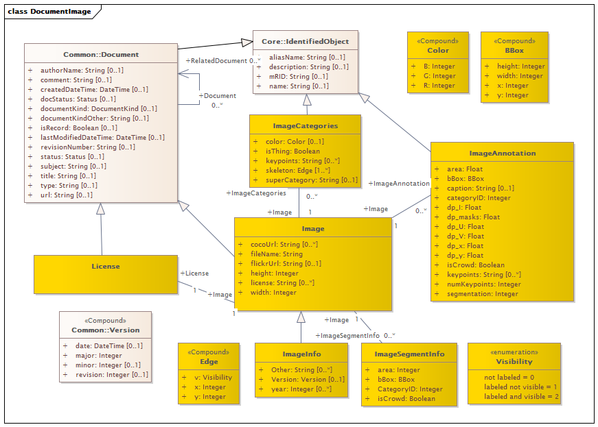

# ImageLicenses
## Directory
- **Message_Examples**: This directory contains sample JSON messages for the various SOAP profiles
- **REST-and-JSON**: This directory contains all software artifacts needed to create a RESTful web service

