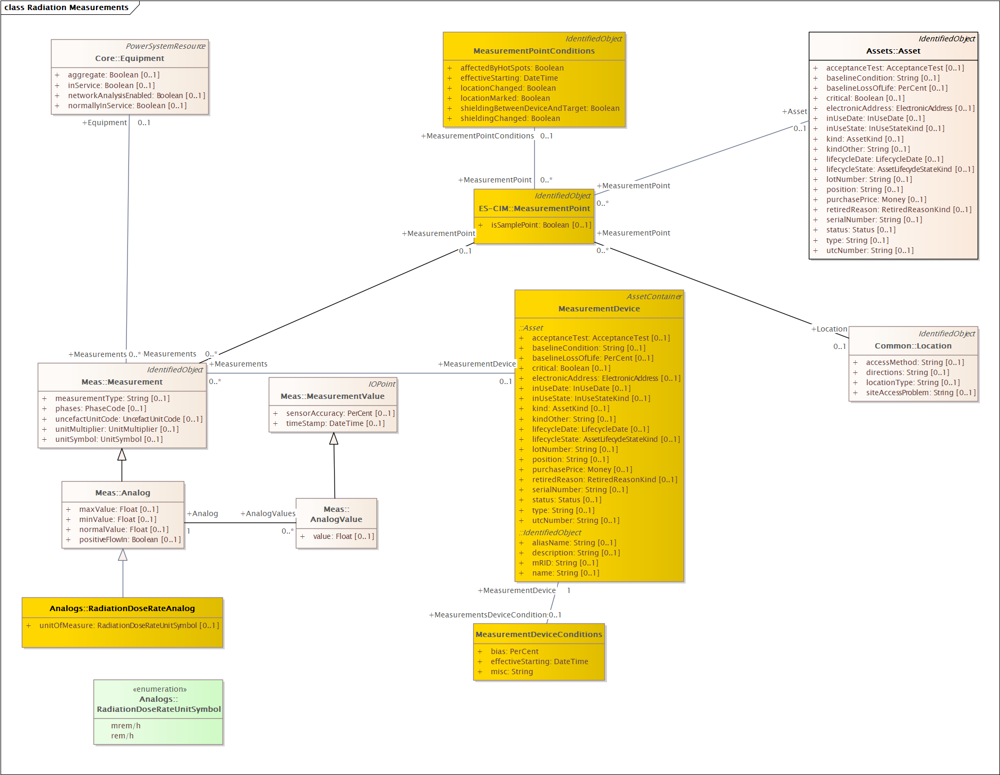

# Spectroscopy
## Directory
- **Message_Examples**: This directory contains sample XML messages for the various SOAP profiles
- **REST-and-JSON**: This directory contains all software artifacts needed to create a RESTful web service
- **WSDLs**: This directory contains all software artifacts needed to create a SOAP web service.

**Note** The diagram for this is the same as the Radiation profile, but with a different analog value being measured (SpecificActivity).
